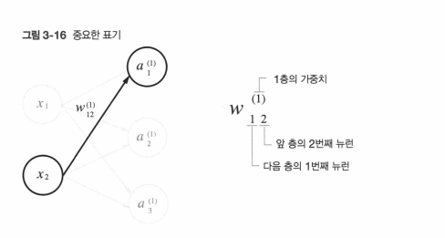
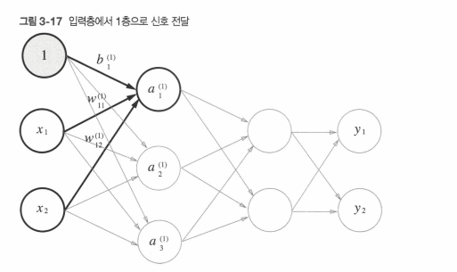
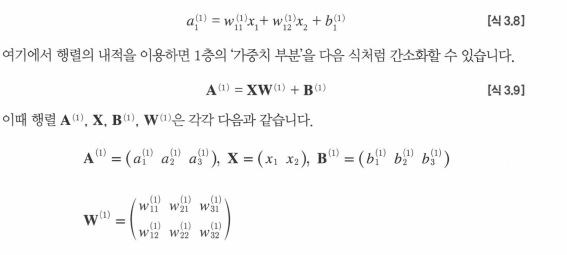
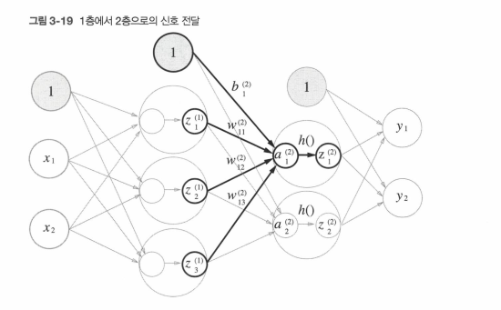
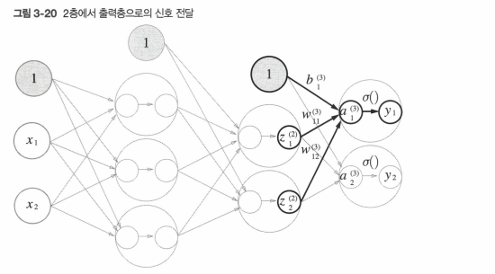

## 0. 목차
- 3.1 퍼셉트론에서 신경망으로
- 3.2 활성화 함수 (시그모이드, 계단 함수, ReLU)
- 3.3 다차원 배열의 계산
- 3.4 3층 신경망 구현하기
- 3.5 출력층 설계하기 (소프트맥스 함수, 항등 함수)
- 3.6 손글씨 숫자 인식 (MNIST 데이터셋)
- 3.7 정리


---
## 1. 퍼센트론 - 신경망
-  신경망은 입력층, 은닉층, 출력층으로 구성.
- 퍼셉트론에 가중치를 곱하고 편향을 더한 값을 로짓.
- 로짓을 활성화 함수에 넣고 나온 값이 결과값.

## 2. 시그모이드
 - h(x) = 1/ (1+ exp(-x))

``` python
# step function
def step _function(x) :

	if x>0 : return 1
	else : return 0

def step_function(x) : #넘파이 배열 전용
	y= x>0 # 0보다 큰 요소만 True 부여
	return y.astype(np.int)
	
```

## 3. 비선형 함수
- 선형 함수 쓰면 아무리 깊은 네트워크를 써도 단일 계층 네트워크와 다름이 없다.
- 따라서 신경망에서는 활성화 함수를 비선형 함수를 사용해야한다.
- ReLU 쓴다.
- ReLu는 입력이 0을 넘으면 그 입력을 그대로 출력하고, 0 이하이면 0을 출력하는 함수

``` python
def relu(x) :
	return np.maximun(0,x)
	
```


## 4. 표기법



## 5. 3층 신경망 구현하기






``` python
def init_network() :
	newwork = {}
	network['W1'] = np.array([0.1,0.3,0.5],[0.2,0.4,0.6])
	network['b1'] = np.array([0.1,0.2,0.3])
	network['W2'] = np.array([0.1,0.4],[0.2, 0.5],[0.3,0.6])
	network['b2'] = np.array([0.1,0.2])
	network['W3'] = np.array([0.1,0.3],[0.2,0.4])
	network['b3'] = np.array([0.1,0.2])
	
	return network

def forward(network, x) : 
	W1,W2,W3 = network['W1'], network['W2'], network['W3']
	b1,b2,b3 = network['b1'], network['b2'], network['b3']
	
	a1 = np.dot(x, W1) + b1
	z1 = sigmoid(a1)
	a2 = np.dot(z1, W2) + b2
	z2 = sigmoid(a2)
	a3 = np.dot(z2, W3) + b3
	y = identity_function(a3)
	
	return y

network = init_network()
x = np.array ([1.0, 0.5])
y = forward(network, x)
print(y) # [0.31.... , 0.6962...]


```


## 6. 출력층
- 회귀에서는 항등 함수를 사용하고, 분류에서는 softmax를 사용한다.
- softmax는 총합이 1이고, softmax의 출력값은 0에서 1.0 사이의 실수이다.
``` python 
#softmax 코드

a = np.array ([0.3, 2.9, 4.0])

exp_a = np.exp(a)

print (exp_a)

sum_exp_a = np.sum(exp_a)
print(sum_exp_a)
y= exp_a / sum_exp_a
print(y)


# softmax 함수
def softmax(a):
	exp_a = np.exp(a)
	sum_exp_a = np.sum(exp_a)
	y = exp_a / sum_exp_a
	return y
	
	
```


### 1). softmax 함수 구현 시 주의점
- 앞선 소프트맥스 함수 코드는 오버플로 문제를 가지고 있다.
- 이 문제를 해결하도록 소프트맥스 함수를 개선한다. 
- 아래 식을 보면 소프트맥스의 지수 함수를 계산할 때 어떤 정수를 더하거나 빼도 결과는 바뀌지 않는다는 것이다.
- 여기서 C prime에 어떤 값을 대입해도 상관없지만, 오버플로를 막을 목적으로는 입력 신호 중 최대 값을 이용하는 것이 일반적이다. 
- 어떤 값을 더하거나 빼도 상관없으니 최대값을 빼서 값의 크기를 줄인다.


``` python
# softmax 함수 개선
a = np. arary([1010, 1000, 990])
np.exp(a) / np.sum(np.exp(a))
array ([nan, nan,nan]) # 이 코드는 제대로 계산되지 않는다. 오버플로

c = np. max(a)
a - c # array ([0,-10,-20])
np.exp(a-c) / np.sum(np.exp(a-c)) # 이 코드는 제대로 계산된다. 


```

``` python
def softmax(a) : 
	c = np.max(a)
	exp_a = np.exp(a-c) # 오버플로 대책
	sum_exp_a = np.sum(exp_a)
	y= exp_a / sum_exp_a
	
	return y
```

### 2). softmax의 효용성과 실무팁
- 장점 :  소프트맥스를 사용해서 문제를 확률적으로 대응할 수 있다.
- 다만, 소프트맥스 함수를 적용해도 각 원소의 대소 관게는 변하지 않는다.
- 이는 지수 함수가 단조 증가 함수이기 때문이다. 
- 신경망을 이용한 분류에서는 일반적으로 가장 큰 출력을 내는 뉴런에 해당하는 클래스로만 인식한다.
- 따라서, 신경망으로 분류할 때는 출력층의 소프트맥스 함수를 생략해도 된다.
- 현업에서도 지수 함수 계산에 드는 자원 낭비를 줄이고자 출력층의 소프트맥스 함수는 생략한다.
---
## 7. MNIST 코드 해체 분석
- MNIST 손글씨 숫자 이미지 집합. 
- 책에서 제공하는 mnist.py에 있는 함수를 분석해봐라.


### 0). mnist.py 

``` python
# MNIST 데이터 다운로드 > Numpy빼열로 변환 > pickle로 저장 > 필요할 때 불러옴.

import gzip
import os
import pickle

import numpy as np


# ==================================================
# 1. urllib 모듈 확인
# ==================================================

try:
    # 인터넷에서 MNIST 파일을 다운로드하기 위해 사용한다.
    import urllib.request

except ImportError:

    # Python 3에서는 urllib.request가 존재한다.
    # 존재하지 않는다면 Python 3.x를 사용하지 않는 것으로 판단한다.
    raise ImportError('You should use Python 3.x')


# ==================================================
# 2. MNIST 데이터 파일 정보
# ==================================================

# MNIST 데이터가 저장되어 있는 기본 URL
url_base = 'http://yann.lecun.com/exdb/mnist/'


# MNIST 데이터는 총 4개의 파일로 구성되어 있다.
#
# train_img
# → 훈련용 이미지
#
# train_label
# → 훈련용 정답
#
# test_img
# → 테스트용 이미지
#
# test_label
# → 테스트용 정답
key_file = {
    'train_img': 'train-images-idx3-ubyte.gz',
    'train_label': 'train-labels-idx1-ubyte.gz',
    'test_img': 't10k-images-idx3-ubyte.gz',
    'test_label': 't10k-labels-idx1-ubyte.gz'
}


# ==================================================
# 3. 파일 경로 및 데이터 크기 설정
# ==================================================

# 현재 mnist.py 파일이 있는 디렉터리의 절대 경로
#
# 예:
# /project/dataset/mnist.py
#
# 라면
#
# dataset_dir
# → /project/dataset
dataset_dir = os.path.dirname(
    os.path.abspath(__file__)
)


# NumPy로 변환한 MNIST 데이터를 저장할 pickle 파일
#
# 결과:
# /project/dataset/mnist.pkl
save_file = dataset_dir + "/mnist.pkl"


# MNIST 데이터의 개수
train_num = 60000
test_num = 10000


# 이미지 하나의 원래 형태
#
# 1  → 흑백 이미지이므로 채널이 1개
# 28 → 이미지 높이
# 28 → 이미지 너비
#
# 따라서:
#
# (1, 28, 28)
#
# 이 값은 이 코드에서 직접 사용되지는 않지만
# MNIST 이미지의 원래 크기를 나타낸다.
img_dim = (1, 28, 28)


# 이미지 하나의 픽셀 개수
#
# 28 × 28 = 784
#
# flatten=True일 경우
# 이미지 하나가 (784,) 형태가 된다.
img_size = 784


# ==================================================
# 4. MNIST 파일 다운로드
# ==================================================

def _download(file_name):

    # 다운로드할 파일의 전체 경로를 만든다.
    #
    # 예:
    # dataset_dir
    # + "/"
    # + "train-images-idx3-ubyte.gz"
    #
    # → /project/dataset/train-images-idx3-ubyte.gz
    file_path = dataset_dir + "/" + file_name


    # 이미 파일이 존재한다면
    # 다시 다운로드할 필요가 없으므로 함수를 종료한다.
    if os.path.exists(file_path):
        return


    # 파일이 존재하지 않는 경우에만 다운로드한다.
    print(f"Downloading {file_name} ... ")


    # 인터넷에서 파일을 다운로드한다.
    #
    # url_base + file_name
    # → 다운로드할 인터넷 주소
    #
    # file_path
    # → 저장할 위치
    urllib.request.urlretrieve(
        url_base + file_name,
        file_path
    )


    print("Done")


# ==================================================
# 5. MNIST의 4개 파일을 모두 다운로드
# ==================================================

def download_mnist():

    # key_file에 저장된 4개의 파일 이름을 하나씩 가져온다.
    #
    # key_file.values()
    #
    # → train-images-idx3-ubyte.gz
    # → train-labels-idx1-ubyte.gz
    # → t10k-images-idx3-ubyte.gz
    # → t10k-labels-idx1-ubyte.gz
    for v in key_file.values():

        # 각각의 파일을 다운로드한다.
        #
        # 이미 존재한다면 _download() 내부에서
        # 바로 return한다.
        _download(v)


# ==================================================
# 6. Label 파일을 NumPy 배열로 변환
# ==================================================

def _load_label(file_name):

    # 읽을 파일의 전체 경로를 만든다.
    file_path = dataset_dir + "/" + file_name


    print(f"Converting {file_name} to NumPy Array ...")


    # MNIST label 파일은 .gz 형식으로 압축되어 있다.
    #
    # 'rb'
    # → read + binary
    #
    # 즉 바이너리 형태로 파일을 읽는다.
    with gzip.open(file_path, 'rb') as f:

        # 압축된 파일의 내용을 모두 읽는다.
        #
        # np.frombuffer()
        # → 바이너리 데이터를 NumPy 배열로 해석한다.
        #
        # np.uint8
        # → 각각의 값을 8비트 unsigned integer로 해석
        #
        # offset=8
        # → 파일 앞부분의 8바이트 헤더를 건너뛴다.
        #
        # 즉:
        #
        # [8바이트 헤더][실제 label 데이터]
        #               ↑
        #               여기부터 읽는다.
        labels = np.frombuffer(
            f.read(),
            np.uint8,
            offset=8
        )


    print("Done")


    # label 배열 반환
    #
    # train label이라면:
    #
    # labels.shape
    # → (60000,)
    #
    # test label이라면:
    #
    # labels.shape
    # → (10000,)
    return labels


# ==================================================
# 7. Image 파일을 NumPy 배열로 변환
# ==================================================

def _load_img(file_name):

    # 읽을 파일의 전체 경로를 만든다.
    file_path = dataset_dir + "/" + file_name


    print(f"Converting {file_name} to NumPy Array ...")


    # 이미지 파일도 .gz 형식으로 압축되어 있으므로
    # gzip을 사용해서 바이너리 형태로 읽는다.
    with gzip.open(file_path, 'rb') as f:

        # 바이너리 데이터를 NumPy 배열로 변환한다.
        #
        # 이미지 파일의 앞부분에는 16바이트의 헤더가
        # 존재하기 때문에 offset=16으로 설정한다.
        #
        # 즉:
        #
        # [16바이트 헤더][실제 이미지 픽셀 데이터]
        #                ↑
        #                여기부터 읽는다.
        data = np.frombuffer(
            f.read(),
            np.uint8,
            offset=16
        )


    # --------------------------------------------------
    # 이미지 데이터를 2차원 배열로 변환
    # --------------------------------------------------
    #
    # 원래 이미지 하나는:
    #
    # 28 × 28
    #
    # 픽셀로 이루어져 있다.
    #
    # 28 × 28 = 784
    #
    # 따라서 이미지 하나를 784개의 값으로 펼친다.
    #
    # reshape(-1, 784)
    #
    # 여기서 -1은 NumPy가 알아서 계산하도록 한다.
    #
    # 훈련 데이터라면:
    #
    # (60000, 784)
    #
    # 테스트 데이터라면:
    #
    # (10000, 784)
    #
    # 즉:
    #
    # 이미지 1개 → (784,)
    #
    # 이미지 여러 개 → (이미지 개수, 784)
    data = data.reshape(
        -1,
        img_size
    )


    print("Done")


    # 변환된 이미지 데이터 반환
    return data


# ==================================================
# 8. MNIST 전체 데이터를 NumPy 배열로 변환
# ==================================================

def _convert_numpy():

    # 이미지와 정답 데이터를 하나의 딕셔너리에 저장한다.
    dataset = {}


    # --------------------------------------------------
    # 훈련 데이터
    # --------------------------------------------------

    # 훈련 이미지
    #
    # 결과:
    # (60000, 784)
    dataset['train_img'] = _load_img(
        key_file['train_img']
    )


    # 훈련 정답
    #
    # 결과:
    # (60000,)
    dataset['train_label'] = _load_label(
        key_file['train_label']
    )


    # --------------------------------------------------
    # 테스트 데이터
    # --------------------------------------------------

    # 테스트 이미지
    #
    # 결과:
    # (10000, 784)
    dataset['test_img'] = _load_img(
        key_file['test_img']
    )


    # 테스트 정답
    #
    # 결과:
    # (10000,)
    dataset['test_label'] = _load_label(
        key_file['test_label']
    )


    # 완성된 데이터셋 반환
    #
    # dataset:
    #
    # {
    #     'train_img':   (60000, 784),
    #     'train_label': (60000,),
    #     'test_img':    (10000, 784),
    #     'test_label':  (10000,)
    # }
    return dataset


# ==================================================
# 9. MNIST 데이터 초기화 및 pickle 저장
# ==================================================

def init_mnist():

    # 필요한 MNIST 원본 파일이 없다면 다운로드한다.
    download_mnist()


    # 다운로드한 파일들을 NumPy 배열로 변환한다.
    dataset = _convert_numpy()


    print("Creating pickle file ...")


    # 변환된 dataset을 pickle 파일로 저장한다.
    #
    # 'wb'
    # → write + binary
    #
    # 즉 바이너리 형태로 파일을 저장한다.
    with open(save_file, 'wb') as f:

        # dataset 딕셔너리를 파일에 저장한다.
        #
        # 다음부터는 원본 .gz 파일을 다시 변환하지 않고
        # 이 pickle 파일을 바로 읽을 수 있다.
        pickle.dump(
            dataset,
            f,
            -1
        )


    print("Done!")


# ==================================================
# 10. Label을 One-Hot Encoding으로 변환
# ==================================================

def _change_one_hot_label(X):

    # X에는 정답 숫자가 들어 있다.
    #
    # 예:
    #
    # X = [2, 0, 4]
    #
    # X.size = 3
    #
    # 숫자는 0~9까지 총 10개의 클래스가 있으므로
    # (데이터 개수, 10) 크기의 배열을 만든다.
    #
    # 결과:
    #
    # T.shape = (3, 10)
    T = np.zeros(
        (X.size, 10)
    )


    # --------------------------------------------------
    # One-Hot Encoding
    # --------------------------------------------------
    #
    # np.arange(X.size)
    #
    # X.size = 3이라면:
    #
    # [0, 1, 2]
    #
    # X = [2, 0, 4]
    #
    # 따라서:
    #
    # T[[0, 1, 2], [2, 0, 4]] = 1
    #
    # 즉:
    #
    # T[0, 2] = 1
    # T[1, 0] = 1
    # T[2, 4] = 1
    #
    # 결과:
    #
    # [0, 0, 1, 0, 0, 0, 0, 0, 0, 0]
    # [1, 0, 0, 0, 0, 0, 0, 0, 0, 0]
    # [0, 0, 0, 0, 1, 0, 0, 0, 0, 0]
    T[
        np.arange(X.size),
        X
    ] = 1


    # One-Hot Encoding된 배열 반환
    return T


# ==================================================
# 11. MNIST 데이터 로드
# ==================================================

def load_mnist(
    normalize=True,
    flatten=True,
    one_hot_label=False
):

    """
    MNIST 데이터셋을 읽는다.

    Parameters
    ----------
    normalize :
        이미지의 픽셀 값을
        0~255 → 0.0~1.0으로 정규화할지 결정한다.

    flatten :
        이미지를 1차원으로 펼칠지 결정한다.

        True:
        (60000, 784)

        False:
        (60000, 1, 28, 28)

    one_hot_label :
        정답(label)을 One-Hot Encoding으로
        변환할지 결정한다.

        False:
        [2, 0, 4, ...]

        True:
        [
            [0,0,1,0,0,0,0,0,0,0],
            [1,0,0,0,0,0,0,0,0,0],
            ...
        ]

    Returns
    -------
    (훈련 이미지, 훈련 레이블),
    (시험 이미지, 시험 레이블)
    """


    # ==================================================
    # 12. pickle 파일이 없다면 생성
    # ==================================================

    # mnist.pkl이 존재하지 않는 경우
    # MNIST 데이터를 처음부터 준비한다.
    if not os.path.exists(save_file):

        # 다운로드
        # → NumPy 변환
        # → pickle 저장
        init_mnist()


    # ==================================================
    # 13. 저장된 MNIST 데이터 불러오기
    # ==================================================

    # 이미 만들어진 mnist.pkl 파일을 읽는다.
    with open(save_file, 'rb') as f:

        # pickle 파일에 저장된 dataset을 복원한다.
        dataset = pickle.load(f)


    # ==================================================
    # 14. 이미지 정규화
    # ==================================================

    if normalize:

        # 이미지 데이터만 정규화한다.
        #
        # label은 정답 숫자이므로
        # 정규화하면 안 된다.
        for key in ('train_img', 'test_img'):


            # 원래 이미지 데이터는 uint8이다.
            #
            # float32로 변환해서 실수 연산이 가능하도록 한다.
            dataset[key] = dataset[key].astype(
                np.float32
            )


            # 픽셀 값을 255로 나눈다.
            #
            # 원래:
            #
            # 0 ~ 255
            #
            # 변환 후:
            #
            # 0.0 ~ 1.0
            #
            # 예:
            #
            # 255 → 1.0
            # 128 → 약 0.502
            #   0 → 0.0
            dataset[key] /= 255.0


    # ==================================================
    # 15. One-Hot Encoding
    # ==================================================

    if one_hot_label:

        # 훈련 정답을 One-Hot Encoding으로 변환
        #
        # (60000,)
        # ↓
        # (60000, 10)
        dataset['train_label'] = _change_one_hot_label(
            dataset['train_label']
        )


        # 테스트 정답도 One-Hot Encoding으로 변환
        #
        # (10000,)
        # ↓
        # (10000, 10)
        dataset['test_label'] = _change_one_hot_label(
            dataset['test_label']
        )


    # ==================================================
    # 16. 이미지 형태 변경
    # ==================================================

    # flatten=False인 경우에만 실행된다.
    #
    # flatten=True:
    #
    # (60000, 784)
    #
    # 그대로 사용
    #
    #
    # flatten=False:
    #
    # (60000, 784)
    # ↓
    # (60000, 1, 28, 28)
    #
    # 이미지의 원래 형태를 복원한다.
    if not flatten:

        # 훈련 이미지와 테스트 이미지에 적용한다.
        for key in ('train_img', 'test_img'):

            dataset[key] = dataset[key].reshape(
                -1,
                1,
                28,
                28
            )


    # ==================================================
    # 17. 최종 데이터 반환
    # ==================================================

    # 최종적으로 다음 형태로 반환한다.
    #
    # (
    #     (train_img, train_label),
    #     (test_img, test_label)
    # )
    #
    # 예를 들어 기본 옵션이라면:
    #
    # train_img.shape
    # → (60000, 784)
    #
    # train_label.shape
    # → (60000,)
    #
    # test_img.shape
    # → (10000, 784)
    #
    # test_label.shape
    # → (10000,)
    return (
        (dataset['train_img'], dataset['train_label']),
        (dataset['test_img'], dataset['test_label'])
    )


# ==================================================
# 18. 이 파일을 직접 실행했을 때
# ==================================================

# 이 파일이 다른 파일에서 import된 경우에는 실행되지 않는다.
#
# python mnist.py
#
# 처럼 직접 실행했을 때만 아래 코드가 실행된다.
if __name__ == '__main__':

    # MNIST 데이터를 다운로드하고
    # NumPy 배열로 변환한 뒤
    # mnist.pkl 파일로 저장한다.
    init_mnist()

```


---

### 1). mnist_show.py
- 훈련 이미지 보여주는 코드
- sys : 파이썬이 실행될 때 필요한 환경 정보를 다루는 표준 라이브러리
- os : 운영체제와 관련된 기능을 제공하는 표준 라이브러리
- load_mnis : MNIST 손글씨 숫자 데이터셋을 불러오는 함수입니다.
	- normalize, flatten, one_hot_label 세 가지를 설정한다. 
	- (정규화, 1차원배열만들지, 원핫인코딩 형태)

``` python mnist_show.py
# coding: utf-8

import sys, os
sys.path.append(os.path.join(os.path.dirname(__file__), '..')) # 부모 디렉터리의 파일을 가져올 수 있도록 설정
# __file__은 현재 파일의 경로, ..는 부모 폴더 경로
import numpy as np
from dataset.mnist import load_mnist # dataset 폴더 안의 mnist.py 파일에서 load_mnist 함수를 가져오는 것.

from PIL import Image

def img_show(img):

	pil_img = Image.fromarray(np.uint8(img))
	pil_img.show()

  

(x_train, t_train), (x_test, t_test) = load_mnist(flatten=True, normalize=False)

img = x_train[0]
label = t_train[0]
print(label) # 5
print(img.shape) # (784,)
img = img.reshape(28, 28) # 형상을 원래 이미지의 크기로 변형
print(img.shape) # (28, 28)
img_show(img)


```


### 2). neuralnet_mnist.py  : 신경망 코드

- 신경망 코드  : 입력층(뉴런 784개), 은닉층 2개 ( 뉴런 50개, 뉴런100개), 출력층 ( 뉴런 10개)
- (이미지 크기가 28  x 28 = 784개 이므로 입력층 뉴론 784개)
- (문제가 0에서 9까지의 숫자를 구분하는 문제이므로 출력층 뉴론 10개)
- 여기서는 저장된 '학습된 가중치 매개변수'를 사용한다. 학습을 다루지는 않는다. 
> 배치 : 하나로 묶은 입력 데이터를 배치라고 한다. (묶음의 의미)
> 장점1 : 수치 계산 라이브러리는 큰 배열을 효율적으로 처리할 수 있도록 고도로 최적화되어 있다. 
> 장점2 : 배치 처리를 함으로써 버스에 주는 부하를 줄여서 데이터 전송의 병목을 줄인다.
> (느린 IO를 통해 데이터를 읽는 횟수가 줄어, 빠른 CPU나 GPU로 순수 계산을 수행하는 비율이 높아진다.)


```python
import os
import sys
import pickle
import numpy as np

# 부모 디렉터리의 모듈(dataset, common)을 import할 수 있도록 경로 추가
sys.path.append(os.path.join(os.path.dirname(__file__), '..'))

from dataset.mnist import load_mnist
from common.functions import sigmoid, softmax


# --------------------------------------------------
# MNIST 테스트 데이터 로드
# --------------------------------------------------
def get_data(): # 단순한 데이터 로드
    (_, _), (x_test, t_test) = load_mnist( 
        normalize=True,
        flatten=True,
        one_hot_label=False
    )
    return x_test, t_test


# --------------------------------------------------
# 저장된 신경망 가중치(sample_weight.pkl) 로드
# --------------------------------------------------
def init_network(): 
# pickle 파일인 sample_weight.pkl에 저장된 '학습된 가중치 매개변수' 읽는다.
# 이 파일에는 가중치와 편향 매개 변수가 딕셔너리 변수로 저장되어 있다. 

    weight_path = os.path.join(os.path.dirname(__file__), 'sample_weight.pkl')

    with open(weight_path, 'rb') as f:
        network = pickle.load(f)

    return network


# --------------------------------------------------
# 순전파(Forward Propagation) , 사실상 모델
# --------------------------------------------------
def predict(network, x): 
    W1, W2, W3 = network['W1'], network['W2'], network['W3']
    b1, b2, b3 = network['b1'], network['b2'], network['b3']

    # 입력층 → 은닉층1
    a1 = np.dot(x, W1) + b1
    z1 = sigmoid(a1)

    # 은닉층1 → 은닉층2
    a2 = np.dot(z1, W2) + b2
    z2 = sigmoid(a2)

    # 은닉층2 → 출력층
    a3 = np.dot(z2, W3) + b3
    y = softmax(a3)

    return y


# --------------------------------------------------
# 메인 실행
# --------------------------------------------------
x, t = get_data()
network = init_network()

batch_size = 100
accuracy_cnt = 0


# --------------------------------------------------
# 배치 단위 추론
# --------------------------------------------------
for i in range(0, len(x), batch_size):

    # 입력값 나눈다. (100, 784)
    x_batch = x[i:i + batch_size]
    # 출력값 받는다. (100, 10)
    y_batch = predict(network, x_batch)
    # 각 행에서 가장 큰 확률의 인덱스
    p = np.argmax(y_batch, axis=1) # ??

    # 맞춘 개수 누적
    accuracy_cnt += np.sum(p == t[i:i + batch_size])


# --------------------------------------------------
# 정확도 출력
# --------------------------------------------------
accuracy = accuracy_cnt / len(x)
print(f'Accuracy: {accuracy:.4f}')
```


---
### n). Alpha
- 모르는 것들을 정리
#### (1). pickle
- 프로그램 실행 중에 특정 객체를 파일로 저장하는 기능.
- 저장해둔 pickle 파일을 로드하면 실행 당시의 객체를 즉시 복원 할 수 있다.

#### (2). import 정렬 규칙
- 아래 라이브러리는 알파벳 순으로 정렬 해야한다.
	- 1.표준 라이브러리 - 파이썬에 기본 내장된 모듈
	- 2.서드 파티 라이브러리 - 외부에서 설치하는 패키지
- 표준 라이브러리와 서드파티 사이에는 공백(blank line)을 넣습니다.
